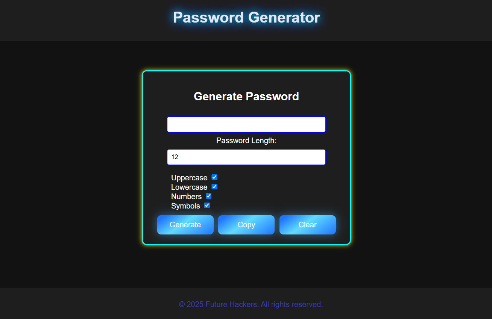

# Password Generator 🔐  

## Description  
This Password Generator is a web-based tool that allows users to generate strong and secure passwords based on selected criteria such as uppercase letters, lowercase letters, numbers, and special symbols. The project features a modern UI with a glowing neon theme for an engaging user experience.  

## Features  
- Generate random passwords of customizable length  
- Options to include uppercase, lowercase, numbers, and symbols  
- Copy generated passwords to the clipboard  
- Clear input fields with a single click  
- User-friendly and responsive UI with a dark theme  

## Technologies Used  
- **HTML**: For structuring the web page  
- **CSS**: For styling, including glowing neon effects  
- **JavaScript**: For generating random passwords dynamically  

## Installation  
1. Clone the repository or download the project files:  
   ```bash
   git clone https://github.com/azeezafarhanashaik/password-generator.git
   ```  
2. Open the `index.html` file in any modern web browser.  

## Usage  
1. Enter the desired password length.  
2. Select the character options (uppercase, lowercase, numbers, symbols).  
3. Click the **Generate** button to create a password.  
4. Use the **Copy** button to copy the password to the clipboard.  
5. Click **Clear** to reset the inputs.  

## Live Demo  
Check out the live version here: [Password Generator](https://azeezafarhanashaik.github.io/password-generator/)  

## Screenshot  
  
 
## Author  
**Azeeza Farhana**  
[GitHub Profile](https://github.com/azeezafarhanashaik)  
